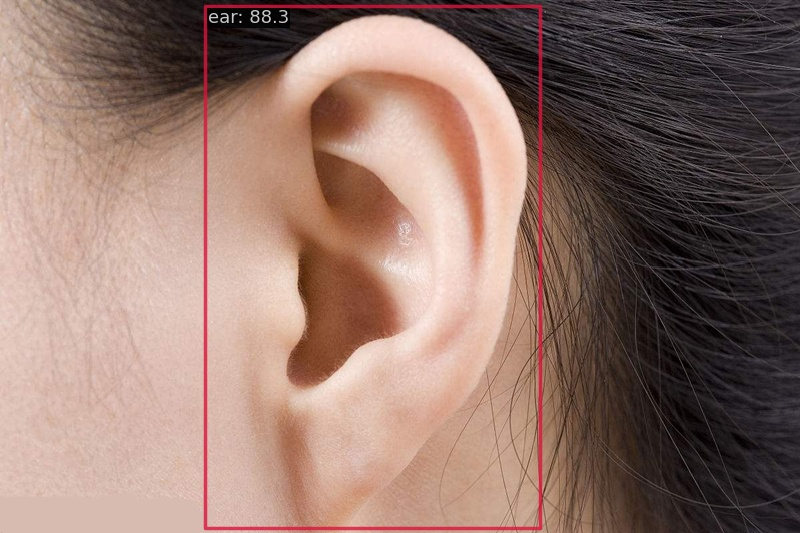
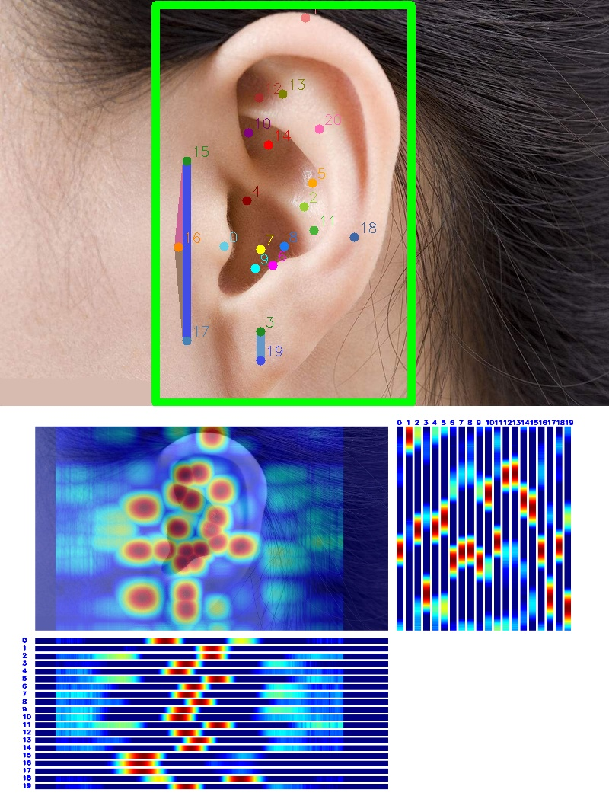

# homework1
## 作业介绍
**题目：基于RTMPose的耳朵穴位关键点检测**

**背景：**根据中医的“倒置胎儿”学说，耳朵的穴位反映了人体全身脏器的健康，耳穴按摩可以缓解失眠多梦、内分泌失调等疾病。耳朵面积较小，但穴位密集，涉及耳舟、耳轮、三角窝、耳甲艇、对耳轮等三维轮廓，普通人难以精准定位耳朵穴位。

**任务：**

1. Labelme标注关键点检测数据集（子豪兄已经帮你完成了）
2. 划分训练集和测试集（子豪兄已经帮你完成了）
3. Labelme标注转MS COCO格式（子豪兄已经帮你完成了）
4. 使用MMDetection算法库，训练RTMDet耳朵目标检测算法，提交测试集评估指标
5. 使用MMPose算法库，训练RTMPose耳朵关键点检测算法，提交测试集评估指标
6. 用自己耳朵的图像预测，将预测结果发到群里
7. 用自己耳朵的视频预测，将预测结果发到群里
8. 需提交的测试集评估指标（不能低于baseline指标的50%）

## 训练
### mmdet
训练后的权重文件，经过精简后为rtmdet_tiny_ear_epoch_200-858a2a73.pth
模型在测试集上的评估指标：

完整的训练日志：20230607_222528.log

### mmpose
训练后的权重文件，经过精简后为rtmpose-s-ear-300-eba8780d_20230608.pth
模型在测试集上的评估指标:

完整的训练日志：20230608_161918.log
## 测试
在这里仅展现图片检测结果
### mmdet
```python
# RTMDet
!python demo/image_demo.py \
        data/test_ear.jpeg \
        data/rtmdet_tiny_ear.py \
        --weights checkpoint/rtmdet_tiny_ear_epoch_200-858a2a73.pth \
        --out-dir outputs/ear \
        --device cuda:0 \
        --pred-score-thr 0.3
```

### mmpose
```python
# RTMDet --> RTMPose
!python demo/topdown_demo_with_mmdet.py \
        data/rtmdet_tiny_ear.py \
        checkpoint/rtmdet_tiny_ear_epoch_200-858a2a73.pth \
        data/rtmpose-s-ear.py \
        checkpoint/rtmpose-s-ear-300-eba8780d_20230608.pth \
        --input data/test_ear.jpeg \
        --output-root outputs/test-ear \
        --device cuda:0 \
        --bbox-thr 0.5 \
        --kpt-thr 0.5 \
        --nms-thr 0.3 \
        --radius 10 \
        --thickness 10 \
        --draw-bbox \
        --draw-heatmap \
        --show-kpt-idx
```

