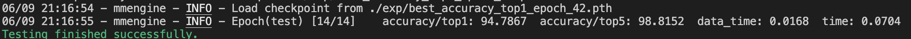
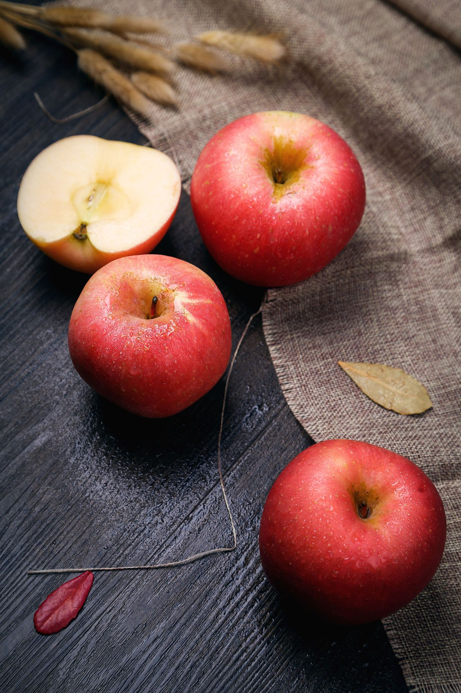
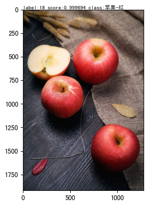

# homework2
## 作业介绍
**题目：** 基于 ResNet50 的水果分类

**背景：** 使用基于卷积的深度神经网络 ResNet50 对 30 种水果进行分类

**任务**

1. 划分训练集和验证集
2. 按照 MMPreTrain CustomDataset 格式组织训练集和验证集
3. 使用 MMPreTrain 算法库，编写配置文件，正确加载预训练模型
4. 在水果数据集上进行微调训练
5. 使用 MMPreTrain 的 ImageClassificationInferencer 接口，对网络水果图像，或自己拍摄的水果图像，使用训练好的模型进行分类
6. 需提交的验证集评估指标（不能低于 60%）

## 划分数据集
运行split_dataset.py，按照CustomDataset的格式进行划分数据集。

## 编写配置文件
创建工程文件夹mmpretrain/projects/fruits
选取resnet50_8xb32_in1k.py为参考，新建resnet50_finetune.py这个config
- 模型：修改`num_classes`为30，加载预训练模型
- 数据集：数据类型要改成`’CustomDataset’`，然后将数据集一一对应
- 训练策略：把学习率调为`lr=0.01`，训练轮次为`max_epochs=50`，同时修改了checkpoint的hook，使保留最优结果，以及最近的5个结果。
```python
checkpoint=dict(type='CheckpointHook', interval=1, save_best='auto', max_keep_ckpts=5),
```

## 训练
```bash
mim train mmpretrain resnet50_finetune.py --work-dir=./exp
```
resnet50(epoch=50)

配置文件为：[resnet50_finetune.py](resnet50_finetune.py)

训练日志为：[20230609_205459.log](20230609_205459.log)


## 验证
```bash
mim test mmpretrain resnet50_finetune.py --checkpoint ./exp/best_accuracy_top1_epoch_42.pth 
```
测试集评估日志为：[20230609_211648.log](20230609_211648.log)

结果如下：



## 预测
预测使用了API，同时解决了中文显示的问题:[predict.ipynb](predict.ipynb)
原图为：



预测结果如下：



这里参考了两位同学

[CrabBoss-lab](https://github.com/CrabBoss-lab/openmmlab-Camp/blob/master/02-mmpretrain-task/05%E9%A2%84%E6%B5%8B.ipynb)

[xiaomile](https://github.com/xiaomile/Openmmlab-AI-Camp-2th/blob/main/%E4%BD%9C%E4%B8%9A2/testpic.py)
